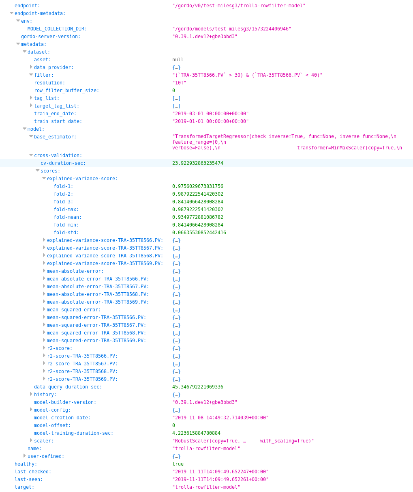

Endpoints
---------

==================
Project index page
==================

Going to the base path of the project, ie. ``/gordo/v0/my-project/`` will return the
project level index, with returns a collection of the metadata surrounding the models currently deployed and their status.
Each ``endpoint`` key has an associated ``endpoint-metadata`` key which is the direct transferal of metadata returned from
the ML servers at their :ref:`ml-server-metadata-route` route.

This returns *a lot* of metadata data, so we'll show a small screen-shot of some of the data you might expect to get:

----

==============================
Machine Learning Server Routes
==============================

When a model is deployed from a config file, it results in a ML
server capable of the following paths:

Under normal Equinor deployments, paths listed below should be prefixed with ``/gordo/v0/<project-name>/<model-name>``.
Otherwise, the paths listed below are the raw exposed endpoints from the server's perspective.

----

/
=

This is the Swagger UI for the given model. Allows for manual testing of endpoints via a GUI interface.

----

.. _prediction-endpoint:

/prediction/
============

The ``/prediction`` endpoint will return the basic values a model
is capable of returning. Namely, this will be:

- ``model-output``:
    - The raw model output, after calling ``.predict`` on the model or pipeline
      or ``.transform`` if the pipeline/model does not have a ``.predict`` method.
- ``original-input``:
    - Represents the data supplied to the Pipeline, the raw untransformed values.

Sample response:

.. code-block:: python

    {'data': {'end': {'end': {'0': None, '1': None}},
          'model-input': {'TAG-1': {'0': 0.7149938815135232,
                                    '1': 0.5804863352453888},
                          'TAG-2': {'0': 0.724091483437877,
                                    '1': 0.9307866320901698},
                          'TAG-3': {'0': 0.018676439423681468,
                                    '1': 0.3389969016787632},
                          'TAG-4': {'0': 0.285813103358881,
                                    '1': 0.12008312306966606}},
          'model-output': {'TARGET-TAG-1': {'0': 31.12387466430664,
                                            '1': 31.12371063232422},
                           'TARGET-TAG-2': {'0': 30.122753143310547,
                                            '1': 30.122438430786133},
                           'TARGET-TAG-3': {'0': 20.38254737854004,
                                            '1': 20.382972717285156}},
          'start': {'start': {'0': None, '1': None}}}}

The endpoint only accepts POST requests.

``POST`` requests take raw data:

.. code-block:: python

    >>> import requests
    >>>
    >>> # Single sample:
    >>> requests.post("https://my-server.io/prediction", json={"X": [1, 2, 3, 4]})  # doctest: +SKIP
    >>>
    >>> # Multiple samples:
    >>> requests.post("https://my-server.io/prediction", json={"X": [[1, 2, 3, 4], [5, 6, 7, 8]]})  # doctest: +SKIP

**NOTE:** The client must provide the correct number of input features, ie. if the model was trained on 4 features,
the client should provide 4 feature sample(s).

You may also supply a dataframe using :func:`gordo.server.utils.dataframe_to_dict`:

.. code-block:: python

    >>> import requests
    >>> import pprint
    >>> from gordo.server import utils
    >>> import pandas as pd
    >>> X = pd.DataFrame({"TAG-1": range(4),
    ...                   "TAG-2": range(4),
    ...                   "TAG-3": range(4),
    ...                   "TAG-4": range(4)},
    ...                   index=pd.date_range('2019-01-01', '2019-01-02', periods=4)
    ... )
    >>> resp = requests.post("https://my-server.io/gordo/v0/project-name/model-name/prediction",
    ...                      json={"X": utils.dataframe_to_dict(X)}
    ... )
    >>> pprint.pprint(resp.json())
    {'data': {'end': {'end': {'2019-01-01 00:00:00': None,
                              '2019-01-01 08:00:00': None,
                              '2019-01-01 16:00:00': None,
                              '2019-01-02 00:00:00': None}},
          'model-input': {'TAG-1': {'2019-01-01 00:00:00': 0,
                                    '2019-01-01 08:00:00': 1,
                                    '2019-01-01 16:00:00': 2,
                                    '2019-01-02 00:00:00': 3},
                          'TAG-2': {'2019-01-01 00:00:00': 0,
                                    '2019-01-01 08:00:00': 1,
                                    '2019-01-01 16:00:00': 2,
                                    '2019-01-02 00:00:00': 3},
                          'TAG-3': {'2019-01-01 00:00:00': 0,
                                    '2019-01-01 08:00:00': 1,
                                    '2019-01-01 16:00:00': 2,
                                    '2019-01-02 00:00:00': 3},
                          'TAG-4': {'2019-01-01 00:00:00': 0,
                                    '2019-01-01 08:00:00': 1,
                                    '2019-01-01 16:00:00': 2,
                                    '2019-01-02 00:00:00': 3}},
          'model-output': {'TARGET-TAG-1': {'2019-01-01 00:00:00': 31.123781204223633,
                                            '2019-01-01 08:00:00': 31.122915267944336,
                                            '2019-01-01 16:00:00': 31.12187385559082,
                                            '2019-01-02 00:00:00': 31.120620727539062},
                           'TARGET-TAG-2': {'2019-01-01 00:00:00': 30.122575759887695,
                                            '2019-01-01 08:00:00': 30.120899200439453,
                                            '2019-01-01 16:00:00': 30.11887550354004,
                                            '2019-01-02 00:00:00': 30.116445541381836},
                           'TARGET-TAG-3': {'2019-01-01 00:00:00': 20.382783889770508,
                                            '2019-01-01 08:00:00': 20.385055541992188,
                                            '2019-01-01 16:00:00': 20.38779640197754,
                                            '2019-01-02 00:00:00': 20.391088485717773}},
          'start': {'start': {'2019-01-01 00:00:00': '2019-01-01T00:00:00',
                              '2019-01-01 08:00:00': '2019-01-01T08:00:00',
                              '2019-01-01 16:00:00': '2019-01-01T16:00:00',
                              '2019-01-02 00:00:00': '2019-01-02T00:00:00'}}}}
    >>> # Alternatively, you can convert the json back into a dataframe with:
    >>> df = utils.dataframe_from_dict(resp.json())

Furthermore, you can increase efficiency by instead converting your data to parquet with the following:

.. code-block:: python

    >>> resp = requests.post("https://my-server.io/gordo/v0/project-name/model-name/prediction?format=parquet",  # <- note the '?format=parquet'
    ...                      files={"X": utils.dataframe_into_parquet_bytes(X)}
    ... )
    >>> resp.ok
    True
    >>> df = utils.dataframe_from_parquet_bytes(resp.content)

----

/anomaly/prediction/
====================

The ``/anomaly/prediction`` endpoint will return the data supplied by the ``/prediction`` endpoint
but reserved for models which inherit from :class:`gordo.model.anomaly.base.AnomalyDetectorBase`

By this restriction, additional _features_ are calculated and returned (depending on the `AnomalyDetector` model being served.

For example, the :class:`gordo.model.anomaly.diff.DiffBasedAnomalyDetector` will return the following:

- ``tag-anomaly-scaled`` & ``tag-anomaly-unscaled``:
    - Anomaly per feature/tag calculated from the expected tag input (y) and the model's output for those tags (yhat),
      using scaled and unscaled values.
- ``total-anomaly-scaled`` & ``total-anomaly-unscaled``:
    - This is the total anomaly for the given point as calculated by the model, using scaled and unscaled values.

Sample response:

.. code-block:: python

    {'data': {'end': {'end': {'2019-01-01 00:00:00': '2019-01-01T00:10:00',
                              '2019-01-01 08:00:00': '2019-01-01T08:10:00',
                              '2019-01-01 16:00:00': '2019-01-01T16:10:00',
                              '2019-01-02 00:00:00': '2019-01-02T00:10:00'}},
          'model-input': {'TAG-1': {'2019-01-01 00:00:00': 0,
                                    '2019-01-01 08:00:00': 1,
                                    '2019-01-01 16:00:00': 2,
                                    '2019-01-02 00:00:00': 3},
                          'TAG-2': {'2019-01-01 00:00:00': 0,
                                    '2019-01-01 08:00:00': 1,
                                    '2019-01-01 16:00:00': 2,
                                    '2019-01-02 00:00:00': 3},
                          'TAG-3': {'2019-01-01 00:00:00': 0,
                                    '2019-01-01 08:00:00': 1,
                                    '2019-01-01 16:00:00': 2,
                                    '2019-01-02 00:00:00': 3},
                          'TAG-4': {'2019-01-01 00:00:00': 0,
                                    '2019-01-01 08:00:00': 1,
                                    '2019-01-01 16:00:00': 2,
                                    '2019-01-02 00:00:00': 3}},
          'model-output': {'TARGET-TAG-1': {'2019-01-01 00:00:00': 31.123781204223633,
                                            '2019-01-01 08:00:00': 31.122915267944336,
                                            '2019-01-01 16:00:00': 31.12187385559082,
                                            '2019-01-02 00:00:00': 31.120620727539062},
                           'TARGET-TAG-2': {'2019-01-01 00:00:00': 30.122575759887695,
                                            '2019-01-01 08:00:00': 30.120899200439453,
                                            '2019-01-01 16:00:00': 30.11887550354004,
                                            '2019-01-02 00:00:00': 30.116445541381836},
                           'TARGET-TAG-3': {'2019-01-01 00:00:00': 20.382783889770508,
                                            '2019-01-01 08:00:00': 20.385055541992188,
                                            '2019-01-01 16:00:00': 20.38779640197754,
                                            '2019-01-02 00:00:00': 20.391088485717773}},
          'start': {'start': {'2019-01-01 00:00:00': '2019-01-01T00:00:00',
                              '2019-01-01 08:00:00': '2019-01-01T08:00:00',
                              '2019-01-01 16:00:00': '2019-01-01T16:00:00',
                              '2019-01-02 00:00:00': '2019-01-02T00:00:00'}},
          'tag-anomaly-scaled': {'TARGET-TAG-1': {'2019-01-01 00:00:00': 43.9791088965509,
                                                  '2019-01-01 08:00:00': 42.564846544761124,
                                                  '2019-01-01 16:00:00': 41.15033623847873,
                                                  '2019-01-02 00:00:00': 39.73552676971069},
                                 'TARGET-TAG-2': {'2019-01-01 00:00:00': 42.73147969197182,
                                                  '2019-01-01 08:00:00': 41.310514834943056,
                                                  '2019-01-01 16:00:00': 39.88905753340811,
                                                  '2019-01-02 00:00:00': 38.46702390945659},
                                 'TARGET-TAG-3': {'2019-01-01 00:00:00': 26.2922285259887,
                                                  '2019-01-01 08:00:00': 25.005235450434874,
                                                  '2019-01-01 16:00:00': 23.71884761692332,
                                                  '2019-01-02 00:00:00': 22.43317081979476}},
          'total-anomaly-scaled': {'total-anomaly-scaled': {'2019-01-01 00:00:00': 66.71898273252445,
                                                            '2019-01-01 08:00:00': 64.37069672792737,
                                                            '2019-01-01 16:00:00': 62.024759698996235,
                                                            '2019-01-02 00:00:00': 59.68141393388054}}},
    'time-seconds': '0.1623'}

This endpoint accepts only ``POST`` requests.
Model requests are exactly the same as :ref:`prediction-endpoint`, but will require a ``y`` to compare the anomaly
against.

----

/download-model/
================

Returns the current model being served. Loadable via ``gordo.serializer.loads(downloaded_bytes)``

----

.. _ml-server-metadata-route:

/metadata/
==========

Various metadata surrounding the current model and environment.
