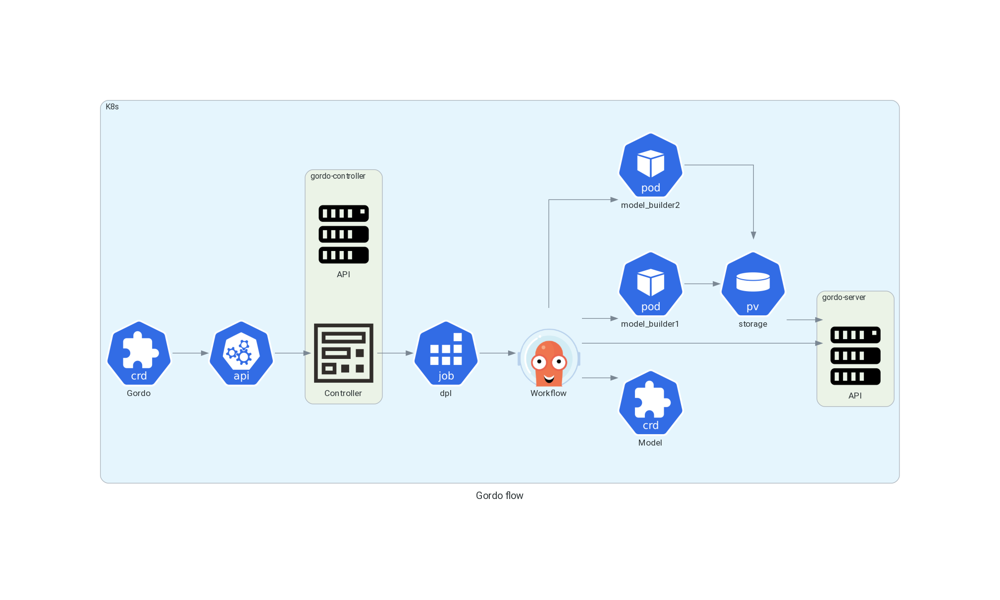

Overview
--------

Gordo is based on parsing a config file written in Yaml
that is converted into an `Argo <https://argoproj.github.io/argo-workflows/>`_ workflow. This is
deployed with `ArgoCD <https://argo-cd.readthedocs.io/en/stable/>`_ onto a Kubernetes cluster.
The main interface after building the models is a set of ``REST`` APIs

`Gordo <https://github.com/equinor/gordo-helm/blob/main/charts/gordo/templates/crds/gordos.equinor.com.yaml>`_ is a `CustomResourceDefinition <https://kubernetes.io/docs/tasks/extend-kubernetes/custom-resources/custom-resource-definitions/>`_
represents the project and could contains multiple Machine Learning models.

`Model <https://github.com/equinor/gordo-helm/blob/main/charts/gordo/templates/crds/models.equinor.com.yaml>`_ is the CustomResourceDefinition
represents the project and can contains multiple Machine Learning models.

`gordo-controller <https://github.com/equinor/gordo-controller>`_ is a `K8S controller <https://cluster-api.sigs.k8s.io/developer/providers/implementers-guide/controllers_and_reconciliation.html>`_ and an API server that provides Gordos/Models statuses.

``dpl`` is a deployment `Job <https://kubernetes.io/docs/concepts/workloads/controllers/job/>`_ thats run :ref:`generate workflow <general/cli:generate>` command.

``model_builder1``, ``model_builder2`` Jobs builds ML models with :ref:`build <general/cli:build>` command.

``storage`` is `PersistentVolume <https://kubernetes.io/docs/concepts/storage/persistent-volumes/>`_ where ML models have to be stored.

``gordo-server`` is a ML Server. Full API spec can be found :ref:`here <general/endpoints:endpoints>`.

.. note::
    In order to reproduce all examples below you can install `this Helm chart <https://github.com/equinor/gordo-helm>`_ on your local `Minikube cluster <https://github.com/equinor/gordo-helm/tree/main/charts/gordo#development-manual>`_.

Simplest possible project with 2 models we could find in ``examples/test-project.yaml``:

.. literalinclude:: ../../examples/test-project.yaml

To deploy this project to the cluster:

.. code-block:: console

    > kubectl apply -f examples/test-project.yaml
    gordo.equinor.com/test-project created

Check status of deployed project:

.. code-block:: console

    > kubectl get gordo
    NAME           MODEL-COUNT   MODELS-BUILT   SUBMITTED   DEPLOY VERSION
    test-project   2             0              1           latest

Then we can track the status of the build process with help of `Argo CLI <https://argoproj.github.io/argo-workflows/quick-start/#install-the-argo-workflows-cli>`_ command:

.. code-block:: console

    > argo list
    NAME                               STATUS    AGE   DURATION   PRIORITY
    test-project-1684991354718-284rq   Running   4s    4s         0

And check models statuses with:

.. code-block:: console

    > kubectl get models
    NAME                       MODELSTATUS   PROJECT REVISION   PROJECT NAME   MODEL NAME
    test-project-model1        Unknown       1685012943886      test-project   model1
    test-project-model2        Unknown       1685012943886      test-project   model2

Check the deployment after workflows will be ``Succeeded``.

For example we could check stored ML models on the disk:

.. code-block:: console

    > kubectl exec -c gordoserver-test-project -it gordo-srv-test-project-68957648c5-hlr2d -- sh
    $ /gordo/models/test-project/models/1685012943886
    info.json  metadata.json  model.pkl

As you see all models have stored by default in directory: ``/gordo/models/<project_name>/models/<revision>``.
``model.pk`` is serialized in :mod:`pickle` format ML model; ``info.json``, ``metadata.json`` is a metadata.

`port-forward <https://kubernetes.io/docs/tasks/access-application-cluster/port-forward-access-application-cluster/#forward-a-local-port-to-a-port-on-the-pod>`_ ML server port first:

.. code-block:: console

    > kubectl port-forward service/gordo-srv-test-project 8888:80
    Forwarding from 127.0.0.1:8888 -> 5555
    Forwarding from [::1]:8888 -> 5555

Check deployed models revisions:

.. code-block:: console

    > curl localhost:8888/gordo/v0/test-project/expected-models
    {"expected-models": ["model1", "model2"], "revision": "1685012943886"}

Also we can interact with deployed ML server with help of `gordo-client <https://github.com/equinor/gordo-client>`_:

.. code-block:: python

    In [1]: from gordo_client.client import Client

    In [2]: client=Client("test-project", host="localhost", port=8888, scheme="http")

    In [3]: client.get_revisions()
    Out[3]:
    {'available-revisions': ['1684992996592',
      '1684997808103',
      '1685009820513'],
     'latest': '1685012943886',
     'revision': '1685012943886'}

    In [4]: client.get_available_machines()
    Out[4]: {'models': ['model1', 'model2'], 'revision': '1685012943886'}

    In [5]: models=client.download_model(revision=1685012943886, targets=["model2"]) # Download and deserialize the model

    In [6]: models["model2"]
    Out[6]:
    DiffBasedAnomalyDetector(base_estimator=Pipeline(steps=[('step_0',
                                                             MinMaxScaler()),
                                                            ('step_1',
                                                             KerasAutoEncoder(kind='feedforward_hourglass',
                                                                              n_features=3,
                                                                              n_features_out=3))]))

    In [7]: machine=client.machine_from_server("model1", revision=1685012943886) # Model description and metadata

    In [8]: type(machine)
    Out[8]: gordo_client.schemas.Machine

    In [9]: import dateutil.parser

    In [10]: start=dateutil.parser.isoparse("2023-09-15T03:10:00+01:00")

    In [11]: end=dateutil.parser.isoparse("2023-09-16T03:10:00+01:00")

    In [12]: prediction_result=client.predict(start=start, end=end, targets=["model1"], revision=1685012943886)

    In [13]: target_name, df, errors = prediction_result[0]

    In [14]: target_name
    Out[14]: 'model1'

    In [15]: df # Predicted time-series
    Out[15]:
                              anomaly-confidence                                            end model-input  ... tag-anomaly-unscaled           total-anomaly-confidence total-anomaly-scaled total-anomaly-unscaled
                                           TAG 1     TAG 2     TAG 3                        end       TAG 1  ...                TAG 2     TAG 3 total-anomaly-confidence total-anomaly-scaled total-anomaly-unscaled
    2023-09-15 01:20:00+00:00           0.361875  0.190095  0.845807  2023-09-15T01:30:00+00:00    0.697429  ...             0.090309  0.295822                 0.371839             0.047341               0.046165
    2023-09-15 01:30:00+00:00           0.054358  0.051845  0.582708  2023-09-15T01:40:00+00:00    0.453543  ...             0.024630  0.203803                 0.114893             0.014628               0.014369
    2023-09-15 01:40:00+00:00           0.417754  0.089309  0.318963  2023-09-15T01:50:00+00:00    0.722056  ...             0.042428  0.111558                 0.193884             0.024685               0.023773
    2023-09-15 01:50:00+00:00           0.710244  0.874646  0.047716  2023-09-15T02:00:00+00:00    0.899236  ...             0.415523  0.016689                 0.911457             0.116044               0.112638
    2023-09-15 02:00:00+00:00           0.168240  0.105187  0.305908  2023-09-15T02:10:00+00:00    0.367228  ...             0.049972  0.106992                 0.062436             0.007949               0.007734
    ...                                      ...       ...       ...                        ...         ...  ...                  ...       ...                      ...                  ...                    ...
    2023-09-16 01:30:00+00:00           0.203257  0.362648  0.709867  2023-09-16T01:40:00+00:00    0.591386  ...             0.172285  0.248277                 0.280183             0.035672               0.034945
    2023-09-16 01:40:00+00:00           0.407669  0.029454  1.217620  2023-09-16T01:50:00+00:00    0.724168  ...             0.013993  0.425864                 0.632106             0.080478               0.078636
    2023-09-16 01:50:00+00:00           0.336009  0.208804  0.715432  2023-09-16T02:00:00+00:00    0.676852  ...             0.099198  0.250223                 0.293874             0.037415               0.036458
    2023-09-16 02:00:00+00:00           0.311596  0.828695  0.634973  2023-09-16T02:10:00+00:00    0.629536  ...             0.393692  0.222083                 0.631042             0.080342               0.078689
    2023-09-16 02:10:00+00:00           0.311596  0.828695  0.634973  2023-09-16T02:20:00+00:00    0.629536  ...             0.393692  0.222083                 0.631042             0.080342               0.078689

    [150 rows x 20 columns]
