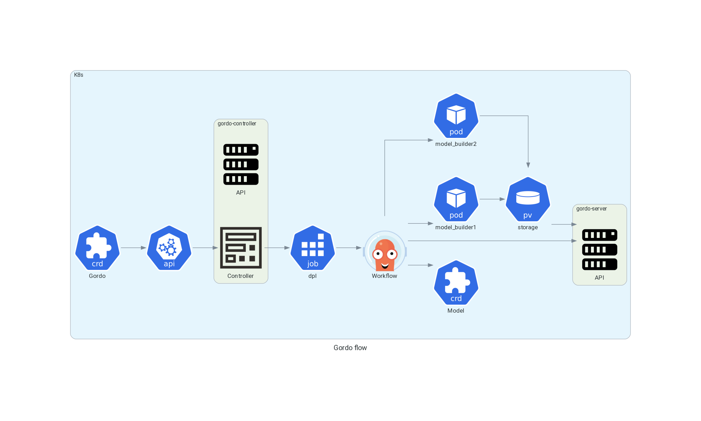

Overview
--------

Gordo is based on parsing a config file written in Yaml
that is converted into an `Argo <https://argoproj.github.io/argo-workflows/>`_ workflow. This is
deployed with `ArgoCD <https://argo-cd.readthedocs.io/en/stable/>`_ onto a Kubernetes cluster.
The main interface after building the models is a set of ``REST`` APIs

`Gordo <https://github.com/equinor/gordo-helm/blob/main/charts/gordo/templates/crds/gordos.equinor.com.yaml>`_ is a `CustomResourceDefinition <https://kubernetes.io/docs/tasks/extend-kubernetes/custom-resources/custom-resource-definitions/>`_
represents the project and could contains multiple Machine Learning models.

`gordo-controller <https://github.com/equinor/gordo-controller>`_ is a `K8S controller <https://cluster-api.sigs.k8s.io/developer/providers/implementers-guide/controllers_and_reconciliation.html>`_ and an API server that provides Gordos/Models statuses.

``dpl`` is a deployment `Job <https://kubernetes.io/docs/concepts/workloads/controllers/job/>`_ thats run :ref:`generate workflow <general/cli:generate>` command.

``model_builder1``, ``model_builder2`` Jobs builds ML models with :ref:`build <general/cli:build>` command.

`Model <https://github.com/equinor/gordo-helm/blob/main/charts/gordo/templates/crds/models.equinor.com.yaml>`_ is the CustomResourceDefinition
represents the model entity generated by the Argo workflow.

``storage`` is `PersistentVolume <https://kubernetes.io/docs/concepts/storage/persistent-volumes/>`_ where ML models have to be stored.

``gordo-server`` is a ML Server. Full API spec can be found :ref:`here <general/endpoints:endpoints>`.
